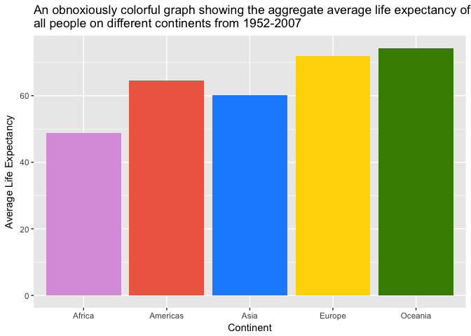

Gapminder!
================
Kaitlyn Harper
September 14, 2017

Hello! We're going to load and explore a few things on the Gapminder dataset today. First, let's load the dataset from Rstudio.

``` r
# Load tidyverse + all corresponding packages!
library(tidyverse)
```

    ## Loading tidyverse: ggplot2
    ## Loading tidyverse: tibble
    ## Loading tidyverse: tidyr
    ## Loading tidyverse: readr
    ## Loading tidyverse: purrr
    ## Loading tidyverse: dplyr

    ## Conflicts with tidy packages ----------------------------------------------

    ## filter(): dplyr, stats
    ## lag():    dplyr, stats

``` r
# Load gapminder dataset
library(gapminder)
data("gapminder")

# View the first 6 lines of the data set (to make sure it's there)
head(gapminder)
```

    ## # A tibble: 6 x 6
    ##       country continent  year lifeExp      pop gdpPercap
    ##        <fctr>    <fctr> <int>   <dbl>    <int>     <dbl>
    ## 1 Afghanistan      Asia  1952  28.801  8425333  779.4453
    ## 2 Afghanistan      Asia  1957  30.332  9240934  820.8530
    ## 3 Afghanistan      Asia  1962  31.997 10267083  853.1007
    ## 4 Afghanistan      Asia  1967  34.020 11537966  836.1971
    ## 5 Afghanistan      Asia  1972  36.088 13079460  739.9811
    ## 6 Afghanistan      Asia  1977  38.438 14880372  786.1134

``` r
# This is also a great way to look at the head of this data set! 
glimpse(gapminder)
```

    ## Observations: 1,704
    ## Variables: 6
    ## $ country   <fctr> Afghanistan, Afghanistan, Afghanistan, Afghanistan,...
    ## $ continent <fctr> Asia, Asia, Asia, Asia, Asia, Asia, Asia, Asia, Asi...
    ## $ year      <int> 1952, 1957, 1962, 1967, 1972, 1977, 1982, 1987, 1992...
    ## $ lifeExp   <dbl> 28.801, 30.332, 31.997, 34.020, 36.088, 38.438, 39.8...
    ## $ pop       <int> 8425333, 9240934, 10267083, 11537966, 13079460, 1488...
    ## $ gdpPercap <dbl> 779.4453, 820.8530, 853.1007, 836.1971, 739.9811, 78...

Sweet! So it looks like we have a few different types of variables in our data set. The country and continent variables are **factors**; the year and pop variables are **integers**; the lifeExp and gdpPercap variables are **numeric**.

Okie doke. Let's take a look at some of the variables now. For example, if we want to find out how many unique countries are in this data set, we could do this:

``` r
# Unique number of countries
length(unique(gapminder$country))
```

    ## [1] 142

Looks like there are 142 countries in our data set. Interesting. I wonder if all the continents are present...

``` r
unique(gapminder$continent)
```

    ## [1] Asia     Europe   Africa   Americas Oceania 
    ## Levels: Africa Americas Asia Europe Oceania

Huh, looks like North and South America are lumped into one, and Antarctica is missing.

I'm pretty sure we're going to get to plotting in the next hw assignment, so let's just explore some of the simple stats for this data set.

``` r
summary(gapminder)
```

    ##         country        continent        year         lifeExp     
    ##  Afghanistan:  12   Africa  :624   Min.   :1952   Min.   :23.60  
    ##  Albania    :  12   Americas:300   1st Qu.:1966   1st Qu.:48.20  
    ##  Algeria    :  12   Asia    :396   Median :1980   Median :60.71  
    ##  Angola     :  12   Europe  :360   Mean   :1980   Mean   :59.47  
    ##  Argentina  :  12   Oceania : 24   3rd Qu.:1993   3rd Qu.:70.85  
    ##  Australia  :  12                  Max.   :2007   Max.   :82.60  
    ##  (Other)    :1632                                                
    ##       pop              gdpPercap       
    ##  Min.   :6.001e+04   Min.   :   241.2  
    ##  1st Qu.:2.794e+06   1st Qu.:  1202.1  
    ##  Median :7.024e+06   Median :  3531.8  
    ##  Mean   :2.960e+07   Mean   :  7215.3  
    ##  3rd Qu.:1.959e+07   3rd Qu.:  9325.5  
    ##  Max.   :1.319e+09   Max.   :113523.1  
    ## 

So it seems like we can glean a few things from this summary. This looks like a longitudinal data set from 1952 to 2007, with 12 observations from most countries.

Okay fineeee, we can do *one little plot* just for kicks!

``` r
cont_LE = gapminder %>% 
  group_by(continent) %>% 
  summarise(avgLifeExp = mean(lifeExp))
  
ggplot(cont_LE, aes(continent, avgLifeExp)) + 
  geom_bar(stat = "identity", fill = c("plum", "coral2", "dodgerblue", "gold", "chartreuse4")) +
  xlab("Continent") +
  ylab("Average Life Expectancy") + 
  ggtitle("An obnoxiously colorful graph showing the aggregate average life expectancy of \nall people on different continents from 1952-2007")
```



Until next time, fRiends!
