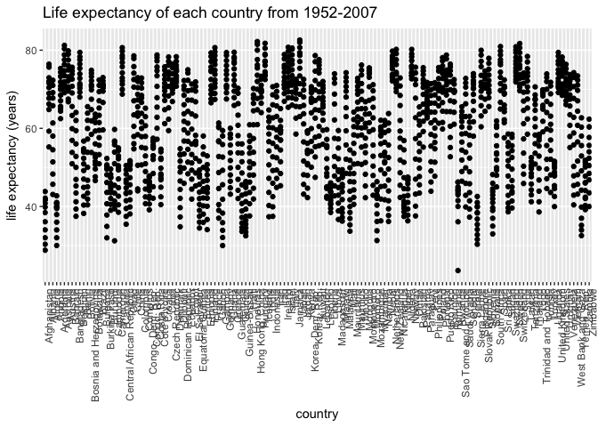
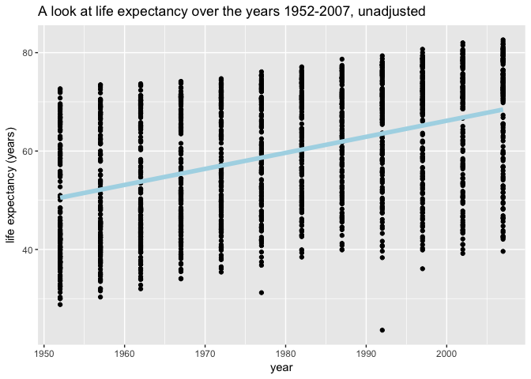
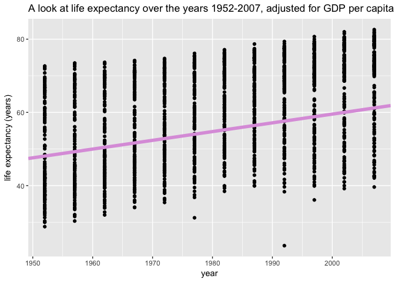

Homework \#2
================
Kaitlyn Harper
September 18, 2017

-   [Bring rectangular data in](#bring-rectangular-data-in)
-   ["Smell test" the data](#smell-test-the-data)
-   [Explore individual variables](#explore-individual-variables)
-   [Explore various plot types](#explore-various-plot-types)
-   [Use filter, select, and pipes!](#use-filter-select-and-pipes)
-   [More, more, more!](#more-more-more)
-   [Reflection](#reflection)

Bring rectangular data in
-------------------------

``` r
# Load tidyverse + all corresponding packages!
library(tidyverse)
```

    ## Loading tidyverse: ggplot2
    ## Loading tidyverse: tibble
    ## Loading tidyverse: tidyr
    ## Loading tidyverse: readr
    ## Loading tidyverse: purrr
    ## Loading tidyverse: dplyr

    ## Conflicts with tidy packages ----------------------------------------------

    ## filter(): dplyr, stats
    ## lag():    dplyr, stats

``` r
# Load gapminder dataset
library(gapminder)
data("gapminder")

#View data (just to make sure it's there)
head(gapminder)
```

    ## # A tibble: 6 x 6
    ##       country continent  year lifeExp      pop gdpPercap
    ##        <fctr>    <fctr> <int>   <dbl>    <int>     <dbl>
    ## 1 Afghanistan      Asia  1952  28.801  8425333  779.4453
    ## 2 Afghanistan      Asia  1957  30.332  9240934  820.8530
    ## 3 Afghanistan      Asia  1962  31.997 10267083  853.1007
    ## 4 Afghanistan      Asia  1967  34.020 11537966  836.1971
    ## 5 Afghanistan      Asia  1972  36.088 13079460  739.9811
    ## 6 Afghanistan      Asia  1977  38.438 14880372  786.1134

"Smell test" the data
---------------------

**Q1: Is it a data.frame, a matrix, a vector, a list?** **Q2: What’s its class?**

``` r
class(gapminder)
```

    ## [1] "tbl_df"     "tbl"        "data.frame"

The data set is a data frame, but it has three official classes: *data frame tbl, tbl,* and *data frame*

**Q3: How many variables/columns?** **Q4: How many rows/observations?**

``` r
ncol(gapminder)
```

    ## [1] 6

``` r
nrow(gapminder)
```

    ## [1] 1704

There are 6 variables/columns and 1704 rows in this data set.

**Q5: Can you get these facts about “extent” or “size” in more than one way? Can you imagine different functions being useful in different contexts?**

``` r
glimpse(gapminder)
```

    ## Observations: 1,704
    ## Variables: 6
    ## $ country   <fctr> Afghanistan, Afghanistan, Afghanistan, Afghanistan,...
    ## $ continent <fctr> Asia, Asia, Asia, Asia, Asia, Asia, Asia, Asia, Asi...
    ## $ year      <int> 1952, 1957, 1962, 1967, 1972, 1977, 1982, 1987, 1992...
    ## $ lifeExp   <dbl> 28.801, 30.332, 31.997, 34.020, 36.088, 38.438, 39.8...
    ## $ pop       <int> 8425333, 9240934, 10267083, 11537966, 13079460, 1488...
    ## $ gdpPercap <dbl> 779.4453, 820.8530, 853.1007, 836.1971, 739.9811, 78...

One way you could get these dimensions (and a bunch of other info about the data set) is by using the glimpse function. This function also provides the class of each variable and the first rows for each variable. This could be helpful when you want to find out more info with fewer clicks, and it can also help us answer the next question! :)

**Q6: What flavor is each variable?** The country and continent variables are **factors**; the year and pop variables are **integers**; the lifeExp and gdpPercap variables are **numeric**.

Explore individual variables
----------------------------

**Pick at least one categorical variable and at least one quantitative variable to explore.** I will explore the country variable and the life expectancy variable.

**Characterize what’s possible, i.e. all possible values or max vs. min … whatever’s appropriate.**

``` r
# Qualitative variable: country
head(unique(gapminder$country)) # shows the unique values within the country variable (only showing the first six)
```

    ## [1] Afghanistan Albania     Algeria     Angola      Argentina   Australia  
    ## 142 Levels: Afghanistan Albania Algeria Angola Argentina ... Zimbabwe

``` r
length(unique(gapminder$country)) # number of unique values within the country variable
```

    ## [1] 142

``` r
head(table(gapminder$country)) # number of rows for each country (only showing first six)
```

    ## 
    ## Afghanistan     Albania     Algeria      Angola   Argentina   Australia 
    ##          12          12          12          12          12          12

``` r
numCountries = table(gapminder$continent)/(table(gapminder$country)[1]) # number of countries within each continent

# Quantitative variable: life expectancy 
summary(gapminder$lifeExp) # provides a simple statistical summary of the variable
```

    ##    Min. 1st Qu.  Median    Mean 3rd Qu.    Max. 
    ##   23.60   48.20   60.71   59.47   70.85   82.60

``` r
length(unique(round(gapminder$lifeExp, 1))) # provides the number of unique life expectancies for all rows (note: I rounded the numbers to provide a more general statistic)
```

    ## [1] 468

*Qualitative variable: country* There are 142 unique countries in this data set. There are 195 countries in the world, so this data set is missing 53 countries. Each country contains 12 rows, or 12 different points in time. There are 5 continents represented in this data set. There are 52 countries represented from Africa, 25 countries represented from the Americas, 33 countries represented from Asia, 30 countries represented from Europe, and 2 countries represented from Oceania

*Quantitative variable: life expectancy* First, we'll look at the life expectancy variable as a whole. The minimum life expectancy from all countries, all years was 23.6 and the maximum life expectancy was 82.6. The mean life expectancy was 59.47. However, this isn't all that helpful to us, because there are multiple countries and multiple time points measured. A bit later, we'll break up some of the countries and time points and get a better look!

**What’s typical? What’s the spread? What’s the distribution? Etc., tailored to the variable at hand.**

``` r
# Plot the life expectancy of each country
ggplot(gapminder, aes(country, lifeExp)) +
  geom_point() +
  theme(axis.text.x = element_text(angle = 90, hjust = 1)) +
  ylab("life expectancy (years)") + 
  ggtitle("Life expectancy of each country from 1952-2007")
```

 This is a pretty cluttered plot, if I do say so myself. A bit later we'll take a look at what happens when you separate countries with filter and select!

Explore various plot types
--------------------------

``` r
a = ggplot(gapminder, aes(x= year, y = lifeExp))

# Plot life expectancy with unadjusted abline
a + geom_point() + 
  labs(title = "A look at life expectancy over the years 1952-2007, unadjusted", y = "life expectancy (years)") + stat_smooth(method="lm", se=FALSE, color = "lightblue", size = 2)
```



``` r
# Use linear regression to adjust for gdp per capita
reg = lm(gapminder$lifeExp ~ gapminder$year + gapminder$gdpPercap)
summary(reg)
```

    ## 
    ## Call:
    ## lm(formula = gapminder$lifeExp ~ gapminder$year + gapminder$gdpPercap)
    ## 
    ## Residuals:
    ##     Min      1Q  Median      3Q     Max 
    ## -67.262  -6.954   1.219   7.759  19.553 
    ## 
    ## Coefficients:
    ##                       Estimate Std. Error t value Pr(>|t|)    
    ## (Intercept)         -4.184e+02  2.762e+01  -15.15   <2e-16 ***
    ## gapminder$year       2.390e-01  1.397e-02   17.11   <2e-16 ***
    ## gapminder$gdpPercap  6.697e-04  2.447e-05   27.37   <2e-16 ***
    ## ---
    ## Signif. codes:  0 '***' 0.001 '**' 0.01 '*' 0.05 '.' 0.1 ' ' 1
    ## 
    ## Residual standard error: 9.694 on 1701 degrees of freedom
    ## Multiple R-squared:  0.4375, Adjusted R-squared:  0.4368 
    ## F-statistic: 661.4 on 2 and 1701 DF,  p-value: < 2.2e-16

``` r
coeffs = coefficients(reg)

# Plot life expectancy with abline, adjusted for GDP per capita
a + geom_point() + 
  labs(title = "A look at life expectancy over the years 1952-2007, adjusted for GDP per capita", y = "life expectancy (years)") + geom_abline(intercept = coeffs[1], slope = coeffs[2], color = "plum", size = 2)
```



Use filter, select, and pipes!
------------------------------

More, more, more!
-----------------

Reflection
----------
